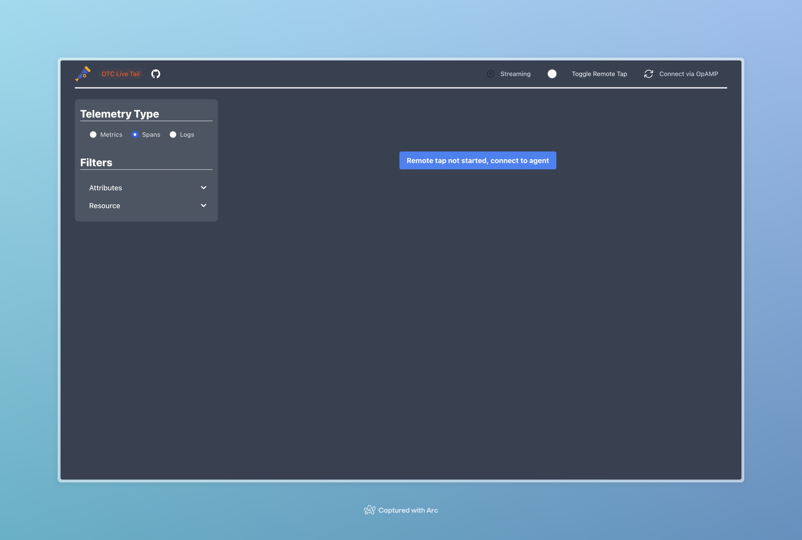
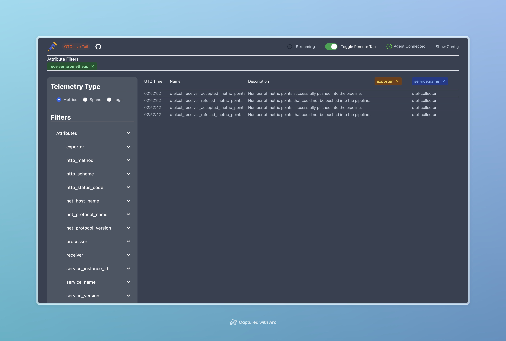
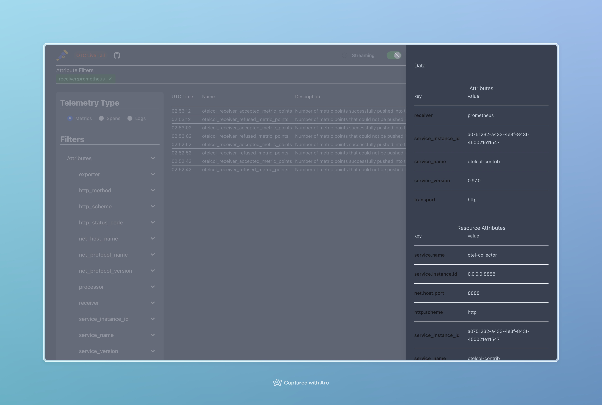
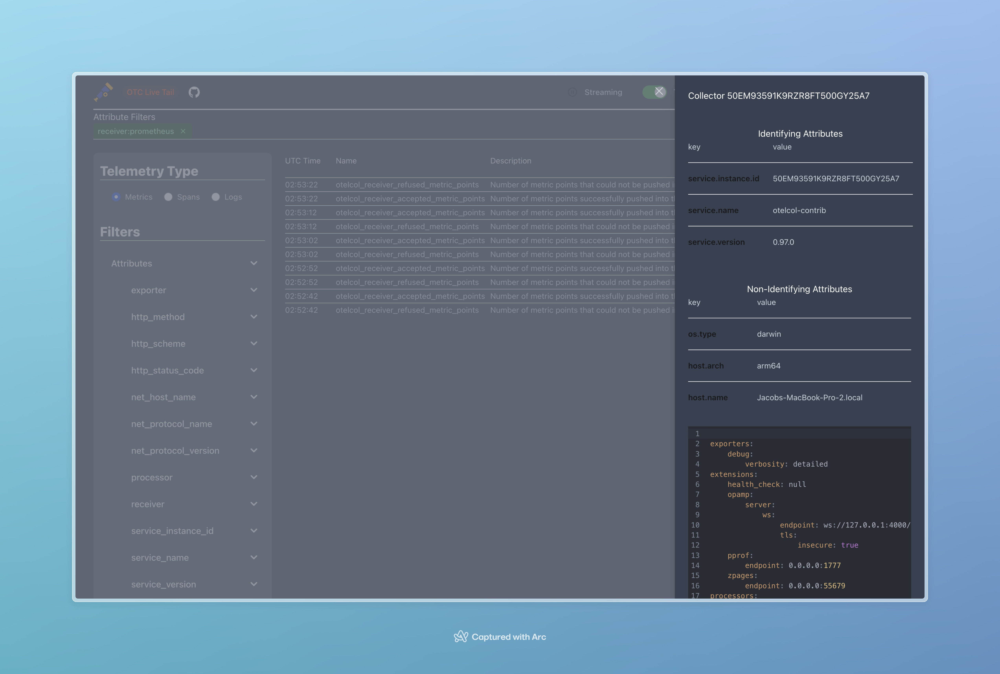

# tails

| Home screen                             | Filters Applied                                                  | Clicking a row                                   | OpAMP Integration                                       |
| --------------------------------------- | ---------------------------------------------------------------- | ------------------------------------------------ | ------------------------------------------------------- |
|  |  |  |  |

tails is a small webserver that listens on a socket and streams live messages from a collector.

## Usage

Tails is primarily used as a sidecar to your collector. The goal of Tails is to be incredibly lightweight such that it doesn't impact the performance or resource utilization of the primary collector. With that in mind, it's best to run Tails in a non-production environment for now.

> NOTE: Make sure to use the appropriate docker container for your environment (currently an amd and arm image are published)

## Collector configuration

At a minimum for tails to function, you must use the [remotetap processor](https://github.com/open-telemetry/opentelemetry-collector-contrib/tree/main/processor/remotetapprocessor) in your collector's configuration. Tails expects to connect to the collector's remotetap processor on _port 12001_ (this will be configurable in the future). It is also recommended to use the [opampextension](https://github.com/open-telemetry/opentelemetry-collector-contrib/tree/main/extension/opampextension) so that you can view the health and configuration for your collector. Here's a minimum sample configuration for a collector with these configured (tested with version 0.97.0 of the collector):

```yaml
extensions:
  opamp:
    server:
      ws:
        endpoint: ws://127.0.0.1:4000/v1/opamp
        tls:
          insecure: true

receivers:
  otlp:
    protocols:
      grpc:
        endpoint: 127.0.0.1:4317
      http:
        endpoint: 127.0.0.1:4318

processors:
  remotetap:
  batch:

exporters:
  debug:
    verbosity: detailed

service:
  pipelines:
    traces:
      receivers: [otlp]
      processors: [remotetap, batch]
      exporters: [debug]

    metrics:
      receivers: [otlp]
      processors: [remotetap, batch]
      exporters: [debug]

    logs:
      receivers: [otlp]
      processors: [remotetap, batch]
      exporters: [debug]

  extensions: [opamp]
```

## Local Development

To start tails:

- Install dependencies with `mix setup`
- Start Phoenix endpoint with `mix phx.server` or inside IEx with `iex -S mix phx.server`
- Run your local collector configuration

Now you can visit [`localhost:4000`](http://localhost:4000) from your browser.
